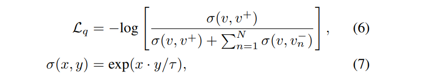

 [HLA-Face: Joint High-Low Adaptation for Low Light Face Detection](https://arxiv.org/abs/2104.01984v1) 收录于CVPR2021，提升弱光环境人脸的检出率。

[源代码](https://daooshee.github.io/HLA-Face-Website/  )

### 摘要

弱光环境下的人脸检测在现实中有着非常重要的应用，如夜间监控视频和自动驾驶等。目前多数人脸检测强依赖于大量的标注，而制作标准数据是非常费时费力的，为了减少制作弱光条件下建立新数据的负担，作者利用现有的正常光下的数据，探索如何适应正常光到弱光下的人脸检测。该任务的难点在于：正常光场景和弱光场景存在巨大且复杂的差异，现有的弱光增强和自适应方式不能达到很好的效果，因为，作者提出了一种联合高低适应（High-Low Adaptation ，HLA) ）框架，具体地，通过一个双向的low-level适应和多任务high-level适应，HLA在没有弱光标签进行训练的情况下，达到了最优效果。<!--more-->

### 引言

人脸检测是许多计算机视觉任务的基础，已广泛应用到实际生活中，如智能监控、人脸解锁以及手机美颜。在过去几十年里，人脸检测研究取得了很大的进展，然而对于不良光照下的场景，很好的检出人脸依旧很困难。在弱光条件下拍摄的图片会出现一系列的退化：能见度低、强烈的噪声和色彩失真。这些退化不仅会影响人类的视觉能力，还会使机器视觉任务性能恶化。

弱光数据DARK FACE的提出催生了大量了弱光人脸检测研究。然而，目前的研究依赖于大量的标注，因此有较差的鲁棒性。

本文作者提出在不需要DARK FACE标注的情况的下，将正常光下的人脸检测模型适应于弱光场景中。作者发现正常光场景和弱光场景存在两个层次的差异：(1)像素级别：不足光照强度、相机噪音、颜色偏差。（2）对象语义级别：街灯、汽车灯、广告牌等。传统的弱光增强方法是为了提高视觉质量而设计的，无法填补语义上的差异。为了人脸检测模型从正常光场景适应到弱光场景下，作者考虑了low-level和high-level的联合适应，提出了HLA框架。具体来说，对于low-level适应，典型方法要么使图像变亮，要么使图像变暗，然而这种单向的从low-to-normal 和从normal-to-low的转换不能达到理想的效果，因此提出让两个域相互靠近一步，通过提高弱光图像的亮度和扭曲正常光图像，建立了介于正常和弱光之间的中间状态。对于high-level自适应，使用多任务自监督学习来缩小由low-level自适应构建的中间状态的特征距离。通过high-level和low-level适应，即时不使用弱光数据标签进行训练，本文方法也比当前最好的人脸检测模型表现更好。总得贡献如下：

- 通过联合high-level和low-level自适应，提出一种不使用弱光标签的弱光人脸检测框架，实现了当前最好性能。

- 对于low-level自适应，设计了一个双向适应思路，对弱光数据进行增强，对正常光数据加入噪声和颜色扭曲色彩，建立中间状态，使两个域相互靠近。

- 对于high-level自适应，引入跨域自监督学习进行特征自适应，通过基于上下文和对比学习，逼近多个域之间的特征距离，增强特征表达能力。

### 弱光检测联合自适应

#### 动机

该任务是将在正常光数据（H）上训练的人脸检测网络适应到未被标注的弱光数据（L）上。如下图所示，现有方法大致分为enhancement, darkening, and feature adaptation  三类。基于enhancement的方式首先增亮弱光图像，然后直接对其进行测试，这类方法通常不需要微调模型，因此非常的灵活。基于darkening的方式首先将正常光的数据变暗，然后重新训练模型。基于特征自适应的方式大多使用对齐、对抗学习或伪标记直接自适应模型特征。

### 

暗光人脸检测的主要问题是H和L之间存在复杂且巨大的差异，目前方法很难处理。在WIDER FACE和DARK FACE中的数据不仅有不同的像素级差异：（明亮v黑暗，干净vs噪声），还包含不同的物体和场景（绘画vs街景）。然而enhancement, darkening只考虑了像素级的差异，Feature adaptation  方法尝试一步填补整个差异，但是效果有限。

对此，作者提出HLA方案，如上图（e）所示，作者设置了L和H之间的中间状态，并根据这些状态自适应相应的高级表达。具体地说，通过增强和暗化来减少H和L之间的low-level距离，相比单向的L->H或H->L，作者提出的双向转换L->E(L)和H-> d (H)，更能缓解自适应的难度。然后通过将多个状态的特征空间相互推近来减少high-level之间的距离。在测试时，仅对图像进行L->E(L)的操作，然后用适应后的人脸检测器对E(L)进行测试。

#### 双向low-level适应

弱光降解是一个复杂的过程，作者将相关因素分为三个：光照、噪声和颜色失真。虽然去燥是颜色校正是非常困难的，但是添加噪声和扭曲颜色是比较容易的。在此基础上，将L进行亮化变成E(L)，对H加入噪声和扭曲颜色使其变成D(H)，与L和H相比，E(L)和D(H)更加相似。这样，我们就可以让H和L彼此走进一步，从而减轻自适应的困难。

**Brightening**  ：与普通的弱光增强任务不同，这里作者想要在不去噪和颜色校正的情况下调整，此外，弱光图像受到不均匀照明的影响，有些人脸被路灯照亮，而有些人脸被黑暗笼罩。因此，还需要防止过度曝光和曝光不足。基于非线性曲线映射[15]，由迭代二次曲线LE(·)构成。

LEo 是输入图片，LEn 是迭代n次的结果。An 是由神经网络估计的像素级别的三通道映射图。与常见的端到端或基于Retinex理论的深度增强方式，曲线映射[15]不会引入额外的噪声或伪影。直接按照[15]的方式进行弱光增强力度不够，很多人脸仍被黑暗笼罩，这是因为过多的增加进行增强会引入噪声。而在本文中，作者为了更多的提高图像亮度，将公式（1）中的迭代次数加倍和扩大曲线估计网络。虽然引入了噪声和使眼色失真，但是可以通过H->D(H)处理。

**Noise Synthesis**：虽然可以通过Brightening减少像素之间的差距，但是E(L)和H之间的差距仍然具有挑战性。因此，作者将剩下的差距进一步分解为颜色和噪声。同时，通过分离颜色，可以利用颜色去引导噪声合成。

如上图所示，首先利用一个双边滤波器对E(L)进行模糊化，然后利用Pix2Pix网络训练E(L)blur ->E(L)，这样就得到了一个添加噪声的网络。最后利用训练好的Pix2Pix网络对H进行添加噪声。Hnoise 成功的模拟了E(L)的噪声。

**Color Jittering**：作者希望D(H)和E(L)之间有着相似的颜色分布，基于静态统计，作者设置了亮度、对比度、饱和度、色度的抖动范围分别在（0.4，1.2）、（0.6，1.4）、（0.6，1.4）和（0.8，1.2）。

#### 多任务high-level适应

特征自适应方法大多是基于对齐、伪标记和对抗学习，然而，对齐和伪标记不能很好的处理巨大的差距，而对抗学习不稳定。作者提出充分利用图像本身的自然信息，通过跨域的自监督分类学习，特征被迫映射到相同的高维子空间，从而缩小high-level之间的特征差距。

为了使E(L)、H和D(H)之间相互靠近，首先通过基于上下文的跨域自监督学习使E(L)和H之间靠近，然后通过跨域对比学习拉近H和D(H)，还通过单域对比学习进一步增强E(L)的表示。以多任务的方式实现整个自适应工作。

**Closing E(L) and H**：基于上下文自监督设计代理任务（pretext tasks），可以使模型学习和理解目标的空间背景信息。在这里，作者使用拼图游戏，作者指出旋转和结合旋转拼图，效果不如单独使用拼图。可能原因，在WIDER FACE数据中，很多图像都是绘画和广告，其中的脸可能有很奇怪的角度，因此旋转预测代理任务可能是模糊不清的。作者将3x3的图像块组成整幅图像，设置图像排列为30，Pjip  作为标签排列，Lc表示交叉熵： 

Fjip表示相应的域提取的特征图，E(L)和H共享分类头，可以迫使语义特征映射到相同的空间中，从而缩小high-level之间的差距。最后拉近E(L)和H的损失为：

**Closing H and D(H)**：对比学习的思想是给定一个 v，识别和它相似的样本v+，和它不相似的样本v-。利用点积来衡量相似性。目标损失为Lq(v,v-,v+)。τ是个温度超参，直观的说，这是一个N+1分类的问题。为了减少H和D(H)之间的距离，作者利用对比学习使正样本更接近。这种方式可以提高H和D(H)之间的特性相似性，拉近high-level之间的差距。

在H和D(H)引入单域对比学习，D(•)表示增广的一部分。简化后损失为公式9，D*(H)有50%的概率为H，有50%的概率为D(H)：

**Enhancing E(L)**：增强E(L)同样也使用对比学习。

**Final objective**：最终的损失函数。

### 实验结果

和当前的一些人脸检测模型、以及基于enhancement, darkening, and feature adaptation 三类方式的适应方式进行对比。

参文：

[15]Zero-referencedeep curve estimation for low-light image enhancement  
