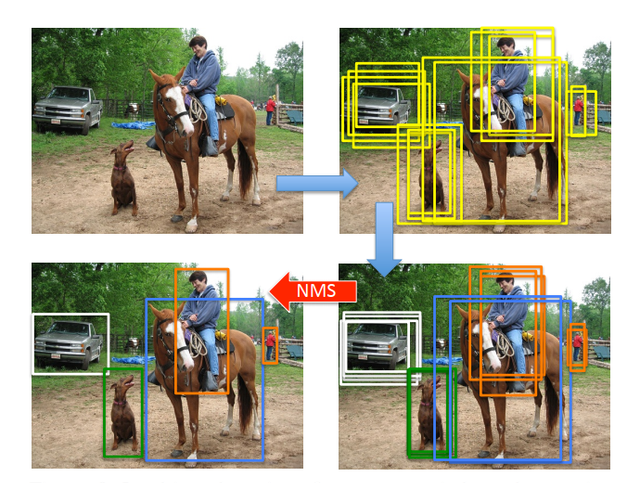
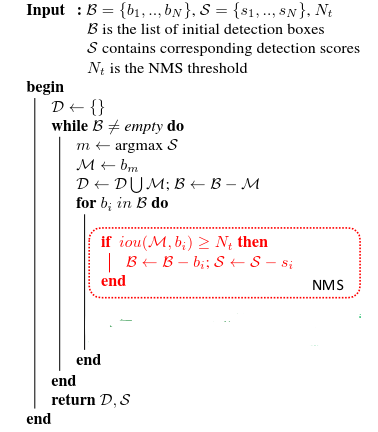
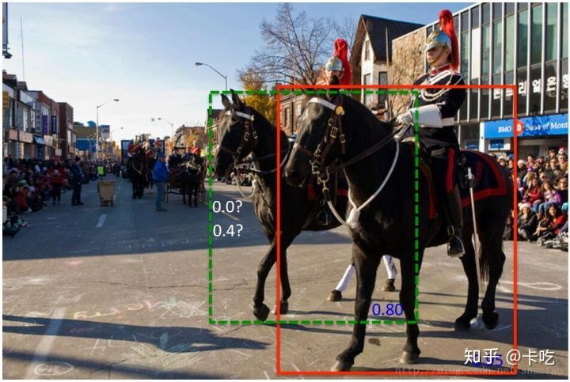
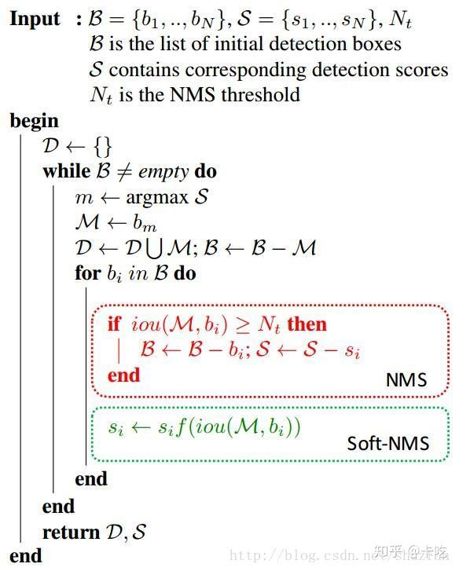

最近一直在做人脸检测的项目，其中有一个重要过程就是剔除冗余的目标框，该过程利用NMS(Non-Maximum Suppression)方法，最近整理出本人对NMS的理解内容，以及基于Python的实现，如有不对请指出。:fallen_leaf::fallen_leaf::fallen_leaf:

非极大值抑制(Non-Maximum Suppression, NMS),就是抑制不是极大值的元素，多用于目标检测中。一般来说，在目标检测算法输出目标框时，目标框会非常多，其中会有很多重复的框定位到同一个目标上，NMS的作用就是去除冗余框，为每一个目标得到唯一的检测框，<!--more-->如下图所示。




### 1、标准的NMS
标准NMS的做法将检测框按得分排序，然后保留得分最高的框，同时删除与该框重叠面积大于一定阈值的其他框。具体的算法流程：



Python实现：

```python
def py_cpu_nms(dets,thresh):
    '''
    dets：[[xmin,ymin,xmax,ymax,scores],...]
    thresh：iou 阈值
    '''
    x1=dets[:,0]
    y1=dets[:,1]
    x2=dets[:,2]
    y2=dets[:,3]
    areas=(x2-x1+1)*(y2-y1+1)
    scores=dets[:,4]

    keep=[]  #存放nms剩余的方框

    index=scores.argsort()[::-1]
    print(index)
    while index.size>0:
        print(index.size)
        i=index[0]
        keep.append(i)
        
        x11 = np.maximum(x1[i], x1[index[1:]])    # calculate the points of overlap 
        y11 = np.maximum(y1[i], y1[index[1:]])
        x22 = np.minimum(x2[i], x2[index[1:]])
        y22 = np.minimum(y2[i], y2[index[1:]])
        
        w=np.maximum(0,x22-x11+1)
        h=np.maximum(0,y22-x11+1)

        overlaps = w*h

        ious=overlaps / (areas[i]+areas[index[1:]]-overlaps)        
        print("ious is :",ious)

        idx=np.where(ious<thresh)[0]

        index=index[idx+1]
        print(index)
    return keep

```
### 2、soft NMS：
论文：[Improving Object Detection With One Line of Code](http://cn.arxiv.org/abs/1704.04503)

提出soft NMS的作者认为，标准NMS会存在如下图所示的问题，红色框和绿色框是当前的检测结果，二者的得分分别是0.95和0.80。如果按照传统的NMS进行处理，首先选中得分最高的红色框，然后绿色框就会因为与之重叠面积过大而被删掉。另一方面，NMS的阈值也不太容易确定，设小了会出现下图的情况（绿色框因为和红色框重叠面积较大而被删掉），设置过高又容易增大误检。​​



soft NMS思想：不要删除所有IOU大于阈值的框，而是降低其置信度。具体的算法流程：



Python实现：
```python
def cpu_soft_nms(boxes, sigma=0.5, Nt=0.3, threshold=0.1, method=2):
    '''
    boxes：[[xmin,ymin,xmax,ymax,scores],...]
    '''
    N = boxes.shape[0]
 
    pos = 0
    maxscore = 0
    maxpos = 0


    for i in range(N):
        # 用冒泡排序法找到分数最高的预测框，并将该预测框放在第i个位置
        maxscore = boxes[i, 4]
        maxpos = i

        # 先用一些中间变量存储第i个预测框
        tx1 = boxes[i,0]
        ty1 = boxes[i,1]
        tx2 = boxes[i,2]
        ty2 = boxes[i,3]
        ts = boxes[i,4]

        pos = i + 1
        # get max box
        while pos < N:
            if maxscore < boxes[pos, 4]:
                maxscore = boxes[pos, 4]
                maxpos = pos
            pos = pos + 1

	    # 将分数最高的预测框M放在第i个位置
        boxes[i,0] = boxes[maxpos,0]
        boxes[i,1] = boxes[maxpos,1]
        boxes[i,2] = boxes[maxpos,2]
        boxes[i,3] = boxes[maxpos,3]
        boxes[i,4] = boxes[maxpos,4]

	    # 将原先第i个预测框放在分数最高的位置
        boxes[maxpos,0] = tx1
        boxes[maxpos,1] = ty1
        boxes[maxpos,2] = tx2
        boxes[maxpos,3] = ty2
        boxes[maxpos,4] = ts

        # 程序到此实现了：寻找第i至第N个预测框中分数最高的框，并将其与第i个预测框互换位置。

        # 预测框M，前缀"t"表示target
        tx1 = boxes[i,0]
        ty1 = boxes[i,1]
        tx2 = boxes[i,2]
        ty2 = boxes[i,3]
        ts = boxes[i,4]

	    # 下面针对M进行NMS迭代过程，
        # 需要注意的是，如果soft-NMS将score削弱至某阈值threshold以下，则将其删除掉
        # 在程序中体现为，将要删除的框放在了最后，并使 N = N-1
        pos = i + 1
        while pos < N:
            x1 = boxes[pos, 0]
            y1 = boxes[pos, 1]
            x2 = boxes[pos, 2]
            y2 = boxes[pos, 3]
            s = boxes[pos, 4]

            area = (x2 - x1 + 1) * (y2 - y1 + 1)
            iw = (min(tx2, x2) - max(tx1, x1) + 1)
            if iw > 0:
                ih = (min(ty2, y2) - max(ty1, y1) + 1)
                if ih > 0:
                    ua = float((tx2 - tx1 + 1) * (ty2 - ty1 + 1) + area - iw * ih)
                    ov = iw * ih / ua  # iou between max box and detection box

                    if method == 1:  # linear
                        if ov > Nt: 
                            weight = 1 - ov
                        else:
                            weight = 1
                    elif method == 2:  # gaussian
                        weight = np.exp(-(ov * ov)/sigma)
                    else:  # original NMS
                        if ov > Nt: 
                            weight = 0
                        else:
                            weight = 1

                    boxes[pos, 4] = weight*boxes[pos, 4]
		    
		            # if box score falls below threshold, discard the box by swapping with last box
		            # update N
                    if boxes[pos, 4] < threshold:
                        boxes[pos,0] = boxes[N-1, 0]
                        boxes[pos,1] = boxes[N-1, 1]
                        boxes[pos,2] = boxes[N-1, 2]
                        boxes[pos,3] = boxes[N-1, 3]
                        boxes[pos,4] = boxes[N-1, 4]
                        N = N - 1
                        pos = pos - 1

            pos = pos + 1

    keep = [i for i in range(N)]
    return keep
```

### 3、weighted NMS：
加权NMS认为传统NMS每次迭代所选出的最大得分框未必是精确定位的，冗余框（得分不是最高的框）也有可能是定位良好的。那么与直接剔除机制不同而是根据网络预测的置信度进行加权，得到新的目标框，把该目标框作为最终的目标框，再将其他框剔除。
具体的算法流程：

<!--  -->

Python实现：
```python
def py_weighted_nms(dets, thresh):
    """
    Takes bounding boxes and scores and a threshold and applies 
    weighted non-maximal suppression.
        
    dets：[[xmin,ymin,xmax,ymax,scores],...]
    thresh：iou 阈值
    """
    scores = dets[:, 4]
    x1 = dets[:, 0]
    y1 = dets[:, 1]
    x2 = dets[:, 2]
    y2 = dets[:, 3]

    areas = (x2 - x1) * (y2 - y1)
    order = scores.argsort()[::-1]
    dets =dets[order]
    max_ids = []
    weighted_boxes = []
    while order.size > 0:
        i = order[0]
        max_ids.append(i)
        xx1 = np.maximum(x1[i], x1[order[:]])
        yy1 = np.maximum(y1[i], y1[order[:]])
        xx2 = np.minimum(x2[i], x2[order[:]])
        yy2 = np.minimum(y2[i], y2[order[:]])

        w = np.maximum(0.0, xx2 - xx1)
        h = np.maximum(0.0, yy2 - yy1)
        inter = w * h
        iou = inter / (areas[i] + areas[order[:]] - inter)

        in_inds = np.where(iou >= thresh)[0]
        
        in_dets = dets[in_inds, :]

        weights = in_dets[:, 4] * iou[in_inds]
        wbox = np.sum((in_dets[:, :4] * weights[..., np.newaxis]), axis=0) \
            / np.sum(weights)
        weighted_boxes.append(wbox)

        out_inds = np.where(iou < thresh)[0]
        order = order[out_inds]
        dets = dets[out_inds]
    scores_frinally=scores[max_ids]
    return max_ids,scores_frinally, np.array(weighted_boxes)
```
### 4、其他思路

以上三种NMS方法都是针对目标检测的效果而设计的算法，在这些NMS算法的实现上首先都用到了排序。在查找资源时，偶然看到一种不需要排序的NMS方式（[浅谈NMS的多种实现](https://zhuanlan.zhihu.com/p/64423753)）。这里我简单介绍一下大佬的实现思路：依次遍历每个框，计算这个框与其他框的iou,找到iou大于一定阈值的其他框，因为这个时候不能保证它一定是score最高的框，所以要进行判断，如果它的score小于其他框，那就把它去掉，因为它肯定不是要保留的框。如果它的score大于其他框，那应该保留它，同时可以去掉所有其他框了。最后保留的框就是结果。其实这种思想就是针对"标准NMS"提出的不用排序的另一种解法。

python实现：

```python
def nms(bbox, scores, thresh):
    area=np.prod(bbox[:,2:]-bbox[:,:2],axis=1)
    keep=np.ones(len(bbox),dtype=bool)
    for i, b in enumerate(bbox):
        if(keep[i]==False):
            continue
        tl=np.maximum(b[:2],bbox[i+1:,:2])
        br=np.minimum(b[2:],bbox[i+1:,2:])
        inter=np.prod(br-tl,axis=1)*(br>=tl).all(axis=1)
        iou=ia/(area[i+1:]+area[i]-inter)
        r = [ k for k in np.where(iou>thresh)[0]+i+1 if keep[k]==True]
        if (scores[i]>scores[r]).all():
            keep[r]=False
        else:
            keep[i]=False
    return np.where(keep)[0].astype(np.int32)
```


相关资源：

[目标检测中的NMS](https://zhuanlan.zhihu.com/p/110256988)

[目标检测中的NMS，soft NMS，softer NMS，Weighted Boxes Fusion](https://blog.csdn.net/practical_sharp/article/details/114980578)

[浅谈NMS的多种实现](https://zhuanlan.zhihu.com/p/64423753)